<div align="center">



<br><br>

# Lumen Bloom &nbsp;·&nbsp; 빛의 탄생

**An infinite-growth ambient arcade game where you evolve from a particle of light dust to a Cosmic Web spanning the universe.**

[](https://www.typescriptlang.org/)
[](https://vitejs.dev/)
[](https://vitest.dev/)
[](https://playwright.dev/)
[](LICENSE)

[**🌐 Live Site**](https://jeiel85.github.io/lumen-bloom/) &nbsp;·&nbsp; [**▶ Play**](https://jeiel85.github.io/lumen-bloom/play.html) &nbsp;·&nbsp; [**📖 Game Design**](docs/02_GAME_DESIGN_DOCUMENT.md) &nbsp;·&nbsp; [**⚙ Architecture**](docs/03_TECHNICAL_ARCHITECTURE.md) &nbsp;·&nbsp; [**🗺 Roadmap**](#implementation-roadmap)

</div>

---

## What is Lumen Bloom?

Lumen Bloom is an **infinite-growth ambient arcade game** built entirely on the web platform — no framework, no accounts, no tracking. You begin as a faint particle of light and absorb smaller motes of energy to grow, evolve, and eventually transcend into a Cosmic Web.

The game emphasises **calm, tactile progression** over competitive pressure. Tension comes from predators, risky routes, and knowing when to settle a run for permanent rewards — not from artificial timers or pay-walls.

> *No account required · No ads · No tracking · Works offline after first load*

---

## Evolution Stages

Your journey unfolds through eight distinct visual identities, each with its own ambient soundscape:

| # | Stage | Emotional Arc | Description |
|:-:|-------|:-------------:|-------------|
| 1 | ✦ **Light Dust** | *Fragile* | A barely-there speck. The world feels vast and dangerous. |
| 2 | ◎ **Droplet** | *Curious* | Gaining cohesion. Magnetism begins to feel natural. |
| 3 | ⟁ **Ripple** | *Rhythmic* | Rings emanate as you move. The world responds to you. |
| 4 | ◌ **Moonlit Lake** | *Serene* | Reflective and calm. The camera reveals the full neighbourhood. |
| 5 | ✶ **Star** | *Radiant* | Warmth and light. Others begin to orbit around you. |
| 6 | ☁ **Nebula** | *Expansive* | Edges blur. You're becoming a region, not a point. |
| 7 | ⊛ **Galaxy** | *Sovereign* | Spiral arms extend. You've become a world unto yourself. |
| 8 | ⊗ **Cosmic Web** | *Sublime* | Threads of connection span the universe. You are everywhere at once. |

---

## Core Features

### ◈ Organic Blob Physics
Your player entity is not a rigid circle — it's a closed perimeter of **spring-connected points** that deform as you move, absorb motes, and collide with the world. The blob shape is driven by a stiffness/damping system tuned for satisfying, responsive feedback.

### ◈ Fixed-Timestep ECS Simulation
A **deterministic 60 Hz fixed-timestep loop** decoupled from rendering frame rate. Physics and logic run at a constant rate with frame-skip protection; the renderer interpolates between ticks. Identical simulation output on every device, with full deterministic replay support for testing.

### ◈ Procedural Web Audio
Ambient soundscapes are synthesised live via the **Web Audio API** — no audio files to download. As you grow through stages, the soundtrack evolves from sparse sine-wave tones to layered harmonic textures. Absorption events trigger procedural chimes.

### ◈ Offline-First PWA
Built for the web, designed for offline. After the first load, Lumen Bloom runs without a network connection. PWA architecture with save-file migration and corruption recovery baked in.

### ◈ Balance-Driven Design
All physics constants, stage thresholds, camera spring values, and enemy behaviour live in **JSON config files** — not hard-coded. Tune the entire feel of the game without touching source code.

### ◈ Universal Input
Full support for **keyboard, mouse/pointer, and touch** with automatic priority arbitration. One input manager that always surfaces the most appropriate device for the current interaction.

---

## Getting Started

### Prerequisites

- **Node.js** 22.12+ (LTS)
- **npm** 10+

### Install & Run

```bash
git clone https://github.com/jeiel85/lumen-bloom.git
cd lumen-bloom
npm install
npm run dev        # → http://localhost:5173
```

### Build for Production

```bash
npm run build      # TypeScript check + Vite bundle → dist/
npm run preview    # Preview the production build locally
```

---

## Development Commands

| Command | Description |
|---------|-------------|
| `npm run dev` | Start Vite dev server with HMR |
| `npm run build` | Type-check + production bundle |
| `npm run preview` | Preview production build |
| `npm test` | Unit tests (Vitest) |
| `npm run test:coverage` | Unit tests with v8 coverage report |
| `npm run test:e2e` | End-to-end tests (Playwright) |
| `npm run lint` | ESLint check |
| `npm run format` | Prettier format |

---

## Architecture

```
src/
├── app/            ← Game loop, bootstrap, systems orchestration
├── domain/         ← Business logic (pure, framework-free)
│   ├── systems/    ← MovementSystem · CameraSystem · AbsorptionSystem
│   │                  GrowthSystem · BlobSystem · RelationshipSystem
│   ├── entities/   ← Mote (pool-managed food particles)
│   ├── math/       ← Vec2, Mulberry32 seeded PRNG
│   └── state/      ← GameState · PlayerState · CameraState type definitions
├── rendering/      ← Canvas 2D orchestrator, blob drawing, camera transform
├── input/          ← InputManager arbitration, Keyboard, Pointer, Touch handlers
├── audio/          ← Web Audio API procedural synthesis (lazy-initialised)
├── config/         ← JSON config loader + AJV schema validation
└── diagnostics/    ← Debug HUD overlay, deterministic replay fixture
```

**Key patterns:**
- **ECS** — Data-oriented entity management; systems operate on pure state
- **Fixed timestep + interpolated rendering** — Physics decoupled from display
- **Seeded PRNG** (Mulberry32) — Deterministic world generation and replay testing
- **Object pools** — Motes reused from pre-allocated arrays to avoid GC pressure
- **Config-first balance** — Every tunable constant is external JSON, not a magic number

---

## Configuration

Gameplay balance lives in `config/*.json` — validated against JSON Schemas at startup:

| File | Controls |
|------|----------|
| `balance.config.json` | Simulation Hz · movement speed/acceleration · absorption radius · camera spring · blob stiffness |
| `stages.config.json` | Stage names · mass unlock thresholds · audio stem assignments · threat budgets |
| `enemies.config.json` | Enemy archetypes · behaviours · spawn weights · threat ratings |
| `traits.config.json` | Player trait and ability definitions |

---

## Documentation

Full design and specification documents in [`docs/`](docs/):

| # | Document | Contents |
|:-:|----------|----------|
| 01 | [Product Requirements](docs/01_PRODUCT_REQUIREMENTS.md) | Scope, users, success criteria |
| 02 | [Game Design Document](docs/02_GAME_DESIGN_DOCUMENT.md) | Full game design — mechanics, feel, systems |
| 03 | [Technical Architecture](docs/03_TECHNICAL_ARCHITECTURE.md) | Runtime, module, and data architecture |
| 04 | [Core Mechanics](docs/04_CORE_MECHANICS.md) | Absorption, growth, physics detail |
| 05 | [Camera & Blob](docs/05_CAMERA_AND_BLOB.md) | Camera spring system, blob spring physics |
| 06 | [World & AI](docs/06_WORLD_AND_AI.md) | World generation, enemy AI, spatial systems |
| 07 | [Progression & Economy](docs/07_PROGRESSION_AND_ECONOMY.md) | Meta-progression, memory shards, rewards |
| 08 | [UI, Audio & Art](docs/08_UI_AUDIO_ART.md) | Glassmorphic UI, Web Audio design, visual stages |
| 09 | [Save & Data](docs/09_SAVE_AND_DATA.md) | Save file format, migration, corruption recovery |
| 10 | [Testing & Performance](docs/10_TESTING_AND_PERFORMANCE.md) | Test strategy, performance budgets, benchmarks |
| 11 | [Security & Release](docs/11_SECURITY_PRIVACY_RELEASE.md) | Privacy policy, security posture, release checklist |
| 12 | [Implementation Contracts](docs/12_IMPLEMENTATION_CONTRACTS.md) | Interface contracts between all modules |
| 13 | [Clean Room & License](docs/13_CLEAN_ROOM_AND_LICENSE.md) | Original work declaration, legal posture |
| 14 | [Release Checklist](docs/14_RELEASE_CHECKLIST.md) | Pre-release verification checklist |

---

## Implementation Roadmap

| Goal | Status | Description |
|:----:|:------:|-------------|
| 01 | ✅ **Complete** | Foundation — project setup, ECS skeleton, config loading & validation |
| 02 | ✅ **Complete** | Fixed-timestep simulation, normalised InputManager, camera spring |
| 03 | ✅ **Complete** | Mote object pooling, magnetism & merge-consume states, blob rendering, Web Audio SFX |
| 04 | 🔜 **Next** | Stage progression system, threat budget, enemy archetypes |
| 05 | 📋 Planned | Meta-progression, memory shards, run settlement |
| 06 | 📋 Planned | World generation, spatial partitioning, enemy AI |
| 07 | 📋 Planned | Audio stems per stage, full ambient synthesis |
| 08 | 📋 Planned | PWA manifest, service worker, offline support |
| 09 | 📋 Planned | Accessibility, reduced-motion, localisation |
| 10 | 📋 Planned | Polish, performance audit, release |

---

## Tech Stack

| Layer | Technology |
|-------|------------|
| Language | TypeScript 5.7 (strict mode) |
| Build tool | Vite 6.0 |
| Runtime | Vanilla TypeScript — zero framework |
| Unit tests | Vitest 3.0 + v8 coverage |
| E2E tests | Playwright 1.49 |
| Config validation | AJV 8 (JSON Schema) |
| Code quality | ESLint 9 + Prettier 3 |
| Target APIs | ES2023 · DOM · Web Audio API · Canvas 2D |
| Target platforms | Web/PWA first → Android/iOS wrappers |

---

## Design Principles

- **No runtime accounts, login, or analytics** — ever
- **Offline play** after first load (PWA model)
- **60 FPS target** on recent phones and PCs
- **All rewards earnable** through play — no gacha, no paid-random
- **Save migration** + corruption recovery built-in
- **Keyboard, mouse, touch, reduced-motion, and mute** all supported

---

## License

Copyright © 2026. All rights reserved.

This is an original creative work. See [`LICENSE`](LICENSE) and [`docs/13_CLEAN_ROOM_AND_LICENSE.md`](docs/13_CLEAN_ROOM_AND_LICENSE.md) for the original-work declaration and legal posture.

---

<div align="center">
  <sub>Made with care &nbsp;·&nbsp; 정성으로 만들었습니다</sub>
</div>
